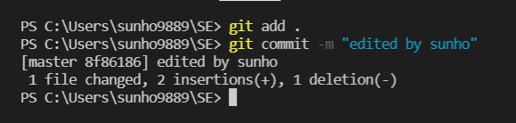

# Git 사용법
## https://github.com/Lee-Sunho/SoftwareEngineering_Git.git
 

## - Git(깃)과 Github(깃허브)란?
Git(깃)은 일종의 형상 관리 도구 중 하나로, 컴퓨터 파일의 변경사항을 추적하고 여러 명의 사용자들이 동시에 해당 파일들의 작업을 조율하기 위한 분산 버전 관리 시스템이다. 깃을 사용하면 여러 명의 개발자들이 소스코드를 따로 주고 받을 필요 없이 하나의 프로젝트를 체계적이고 효율적으로 개발할 수 있다.
 

Github(깃허브)는 깃을 사용하는 프로젝트를 지원하는 웹호스팅 서비스이다. 즉 깃의 데이터를 온라인에 저장해주는 원격 저장소 역할을 하며 코드 공유에 장점을 가지고 있어 병렬 작업과 오픈소스 프로그램 배포 등의 용도로 자주 사용된다. 

## - 깃과 깃허브를 이용해서 프로젝트를 수행해보자.
숭실대학교 컴퓨터학부 2학년 1학기에 재학중인 나는 '소프트웨어공학' 강의에서 'Markdown을 사용한 Markdown 튜토리얼 만들기' 라는 과제를 하고 있다. Markdown에 대해 열심히 공부하고 나는 'SE_HW01.md' 이라는 파일을 작성하였고 이를 C:\Users\sunho9889\SE 의 경로를 가진 SE라는 이름의 폴더 안에 저장하였다. 이 폴더를 깃을 통해 관리하기 위해 터미널에서 C:\Users\sunho9889\SE 경로로 이동한다.  
## git init
터미널에서 git init을 입력하면 현재 디렉토리를 git이 관리하는 working directory로 설정하고 .git 디렉토리를 생성한다. 사진을 보면 빈 깃 저장소가 만들어졌다는 메세지를 확인할 수 있다. 

 

## git config
그 다음 사용할 명령어는 git config이다. git config는 주로 git의 환경설정과 초기화를 하기 위한 명령어이다. 깃을 처음 사용하는 나는 내 이름과 이메일을 설정하였다.   

자주 쓰는 옵션
1) git config --global
  // 깃의 전역 설정을 위한 옵션이다.
> - git config --global user.name "이름" 
// 깃의 전역 사용자명을 설정한다.
> - git config --global user.email "이메일" 
// 깃의 전역 사용자 이메일을 설정한다. 
> - git config --global --list 
// 깃의 전역 설정 정보를 조회한다. 

2) git config
  // 옵션 없이 사용할 경우 현재 위치해 있는 저장소의 설정을 할 수 있다.
> - git config user.name "이름" 
// 해당 저장소의 사용자명을 설정한다.
> - git config user.email "이메일" 
// 해당 저장소의 사용자 이메일을 설정한다. 

 
// 저장소의 사용자명과 전역 사용자명이 다르게 설정된 것을 확인할 수 있다. 

## 깃의 local 저장소
이렇게 깃과 작업환경에 대한 설정이 되었으면 작성한 SE_HW01.md 파일을 깃허브에 백업을 하는 방법을 알아보자. 그 전에 이해를 위해 깃의 local 저장소의 구조를 알고 가야겠다. 
  

Working directory에 있는 파일들은 크게 untracked와 tracked로 나눌 수 있다.
- untracked: 아직 추적되지 않은 파일이다. 깃을 초기화하거나 새로 만든 파일들은 untracked 상태이다.
- tracked: unmodified와 modified로 나눌 수 있으며 
modified인 파일만 staging area로 옮길 수 있다.  

## git status
git status 명령어는 working directory의 상태에 대한 내용을 출력하는 명령어이다.  

  
이를 통해 현재 저장한 SE_HW01.md 파일이 untracked 상태라는 것을 알 수 있다. 

 

Staging Area는 tracked 된 파일들 중 modified된 파일이 저장소에 올라가기 전에 거쳐야하는 중간 단계이다.  

## git add
git add 명령어를 통해 working directory에 있는 tracked 된 파일들 중 modified된 파일을 staging area로 옮길 수 있다. 

사용방법: git add 파일이름 

자주 쓰는 옵션 
- git add .  
// 현재 디렉토리 이하의 모든 변경 내용을 staging area로 넘긴다. 

 

git add를 한 후 다시 git status로 작업 상태를 확인해본 결과 SE_HW01.md가 staging area로 올라간 것을 확인할 수 있다.  

 

.git directory는 local 저장소의 파일이 원격 저장소로 올라가기 바로 전 단계이다.  

## git commit
commit 명령어를 사용하면 staging area에 있는 파일들이 하나의 버전으로서 .git directory에 저장된다.  

사용방법: git commit 
// 옵션없이 사용하면 editor를 호출하여 commit message를 작성한다. 

자주 쓰는 옵션
- git commit -m "메세지" 
// editor에서 별도로 작성할 필요없이 바로 commit한다. 

-git commit -am "메세지" 
// 한번 이상 commit된 대상을 staging area에 add함과 동시에 commit한다. 

 

"first commit of sunho" 라는 commit message로 SE_HW01.md 파일을 커밋 하여 .git directory에 저장하였다.  

하지만 막 커밋을 하자마자 나는 맘에 들지 않는 부분을 발견하였고 SE_HW01.md 파일을 수정하였다. 그리고 git status을 실행해보았다.

 

그랬더니 SE_HW01.md가 수정되었다는 메세지가 출력되었고 이는 아직 staging area에 올라가지 않은 상태였다. 따라서 다시 git add하고 git commit을 실행하였다. 

  

## git log
나는 깃을 처음 사용해서 지금까지 두 번 커밋한 사실이 뿌듯하여 commit history를 사진으로 찍고 싶었다. 따라서 commit history를 출력하는 git log 명령어를 실행하였다. 

  

git log를 통해 commit history를 확인하니 지금까지 수행한 두 번의 commit 시각, commit message들을 볼 수 있었다.  

마지막으로 나는 과제를 검토하기로 했다. 그런데 두 번째 커밋에서 수정한 내용이 조금 애매하다는 생각이 들었다. 그래서 수정하기 전 상태로 돌아가고 싶어졌다.   

## git reset
git reset 명령어를 사용하면 파일을 어느 시점의 커밋으로 돌아가고 싶을 때 사용한다. 이때 git log를 통해 돌아가고 싶은 커밋의 일련번호 앞 6자리 를 reset 할 때 적어주면 해당 커밋으로 돌아갈 수 있다.  

자주 쓰는 옵션
- git reset --hard 돌아가고 싶은 커밋 
// 해당 커밋으로 돌아가고 그 이후의 커밋 기록을 아예 지워버린다. 

 

git reset --hard 실행 후 commit history를 조회한 결과 돌아간 커밋 이후의 기록이 사라진 것을 확인 할 수 있다.  

## git tag
나는 더 나은 과제를 위해서 많은 버전을 만들어 놓고 비교한 후 최종적으로 결정하여 제출하고 싶어졌다. 앞으로 수 많은 커밋을 하기위해 나는 커밋에 표시를 하고 싶어졌다. 이때 git tag를 사용할 수 있다.
tag는 커밋을 쉽게 참조할 수 있도록 간단한 이름을 붙이는 것이다. 

종류
- Lightweight tag
    - git tag 태그명 
// 특정 커밋에 이름을 붙일 수 있다.  

- Annotated tag
    - git tag -a 태그명 -m "태그 메세지"
    // 만든 사람, 이메일 ,날짜, 태그 메세지 등 더 구체적인 정보들을 저장할 수 있다.  

 

git tag를 실행하면 현재 커밋의 tag들을 볼 수 있다. 
 

나는 현재 작업하고있는 master branch에 이 원본을 그대로 두고 다른 branch에서 내용을 추가하는 방법을 사용했다. 

## git branch
사용방법: git branch 브랜치명 
// 새로운 branch를 생성한다. 

자주 쓰는 옵션:
- git branch -b 브랜치명
// 브랜치 생성 후 checkout

- git branch -D 브랜치명
// 브랜치 삭제

 

second라는 이름의 새로운 브랜치를 생성하였고 git branch 명령어를 통해 현재 존재하는 branch들의 목록을 조회한 결과 second 브랜치가 생성된 것을 알 수 있다. 또한 현재 master 브랜치에 위치해 있다는 표시도 확인할 수 있다. 이제 새로 만든 second로 이동해보자.  

## git checkout
사용방법: git checkout 브랜치명 
// 사용할 브랜치로 이동한다. 22222

 

git checkout 명령어를 사용하여 second 브랜치로 이동한 후 git branch로 브랜치의 상태를 확인한 결과 현재 second에 위치해 있는 것을 알 수 있다. 기본적으로 새로 만든 브랜치는 기존 브랜치의 작업상태를 그대로 가져오기 때문에 현재 second는 master와 동일한 작업상태이다. 

나는 second 브랜치에서 SE_HW01.md의 두번째 버전을 작성하였다. 두번째 버전에는 SE_HW01.md에 사용한 사진들을 커밋해보았다. 

 

그리고 second 브랜치의 버전에서 second_1와 second_2 브랜치를 파서 각각 다른 부분을 추가하였다. 또한 second_1 브랜치의 버전에서 second_1_1 브랜치를 파서 수정본을 만들었다.

   

현재 브랜치들은 다음과 같이 생성되있고 각각 내용이 다르다. 

## git merge
second1_1에서 추가한 내용을 second_1 브랜치에 합치고 싶어졌다. 이때 git merge를 사용해서 두 브랜치를 병합할 수 있다. 

 

second_1 브랜치의 SE_HW01.md를 확인해본 결과 second_1_1에서 작성한 내용이 추가된 것을 확인할 수 있었다. 

## git rebase
서로 다른 브랜치들을 병합하는 또다른 방법으로는 git rebase가 있다. 얼핏 보면 merge와 비슷한 기능을 하지만 rebase를 사용하면 훨씬 더 깔끔한 병합이 가능해진다. master 브랜치에는 중간 산물이 아닌 최종 제출본만 저장시킬 것 이다. 이때 rebase를 이용하면 commit의 흐름을 한줄로 만들 수 있어 순서대로 개발한 것 처럼 보이게 된다. rebase 통해 second에 second_1과 second_1_1을 병합시켰다. 

 

또한 second를 master에 병합시켜 하나의 과제물을 완성시켰다. 

이제 깃허브에 나의 repository를 만들고 거기에 SE_HW01.md과 사진들을 백업시킬 차례이다.  

## git clone
깃허브에 만든 repository의 복사본을 내 작업 환경에 가져오고 싶을 때 사용한다.  

사용방법
- git clone "repository 주소"  
// 깃허브에 있는 repository를 복제하여 가져온다. 

 

## git remote
git remote는 현재 디렉토리의 원격 repository를 확인하는 명령어이다. 지금 master 브랜치에서 git remote를 실행한 결과 원격 저장소가 없어서 아무것도 일어나지 않았다. 따라서 나는 만든 repository를 원격 저장소로 추가해줘야했다. 

자주쓰는 옵션
- git remote add origin "repository 주소" 
// repository를 origin 이라는 이름의 원격 저장소를 추가한다.  

 

git remote로 조회한 결과 orgin이라는 이름의 원격저장소가 추가된 것을 확인할 수 있다. 

## git push
이제 로컬 저장소에 있는 파일들을 원격저장소 즉, 깃허브로 옮겨줘야 한다. 이때 사용하는 명령아가 git push이다.  

사용방법
- git push 원격 저장소명 브랜치명  
 

자주 쓰는 옵션
- git push -u 원격 저장소명 브랜치명 
// push 할 때 마다 저장소명과 브랜치명을 입력하는게 귀찮으므로 -u를 사용해 최초에 한 번만 입력하면 그 이후에는 인자 없이 git push로만 실행할 수 있다. 

 

 

push한 결과 깃허브에 master에서 작업한 내용들이 저장된 것을 확인할 수 있었다.  

그런데 깃허브에서 SE_HW01.md 파일을 봤을 때 이미지 하나가 뜨지 않아 문제점을 찾았더니 이미지 파일은 .PNG 지만 코드에는 .png로 되어있었다. 나는 깃허브 내에서 코드를 수정하고 커밋하였다.  

 

깃허브에서 변경된 것을 확인할 수 있었다.  

## git pull
이 변경된 사항을 로컬 저장소에도 불러오고 싶다. 이때 사용하는 명령어가 git pull이다. 이를 통해 원격 저장소의 진행 상황을 로컬 저장소로 받아올 수 있다. 

사용방법
- git pull 원격저장소명 브랜치명

   

이렇게 무사히 과제를 깃허브에 올릴 수 있었다.  

| 명령어 | 사용 여부 | 
| --- | --- |
| [add](#git-add) |  O  |
| [branch](#git-branch) |  O  |
| [checkout](#git-checkout) |  O  |
| [clone](#git-clone) |  O  |
| [commit](#git-commit) |  O  |
| [config](#git-config) |  O  |
| [init](#git-init) |  O  |
| [log](#git-log) |  O  |
| [merge](#git-merge) |  O  |
| [pull](#git-pull) |  O  |
| [push](#git-push) |  O  |
| [rebase](#git-rebase) |  O  |
| [remote](#git-remote) |  O  |
| [reset](#git-reset) |  O  |
| [status](#git-status) |  O  |
| [tag](#git-tag) |  O  |

