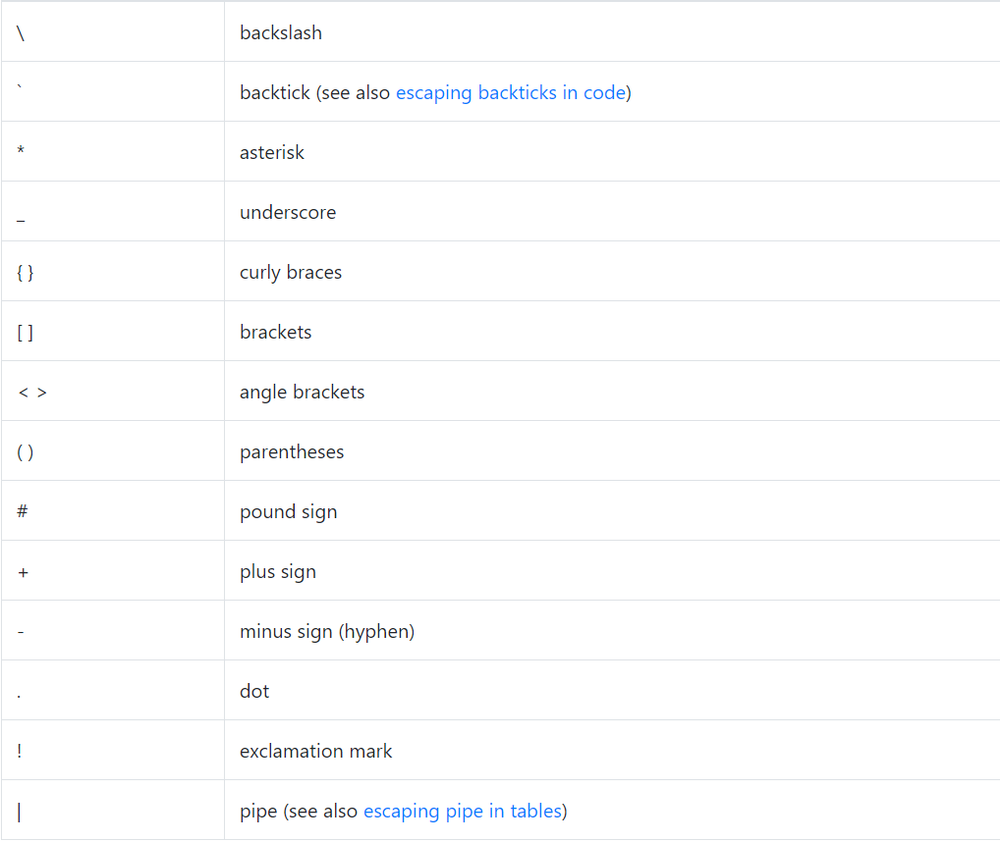

# Markdown 사용법

## 1. 제목(Header)
제목을 짓는 방법은 두가지가 있다.
> ### 1.1 #을 붙이는 방법
>제목 앞에 #을 붙히고 한칸 띄어쓰기 후 제목을 작성할 수 있다. #의 개수가 많을 수록 제목의 크기가 작아진다.
>>ex) \# Heading level 1
>> # Heading level 1    
>>ex) \#\# Heading level 2
>> ## Heading level 2    
>>ex) \#\#\# Heading level 3
>> ### Heading level 3 

 

>### 1.2 == 또는 --을 붙이는 방법
>제목을 쓴 라인 다음 라인에 = 나 - 를 써주면 제목으로 변환된다. =를 쓰면 #을 한개 붙인 크기의 제목이 되고 -을 쓰면 #을 2개 붙인 크기의 제목이 된다.  

 

## 2. 문단(Paragraphs)
문단을 나누기 위해서는 문장들 사이에 엔터를 통해 빈 라인을 사용하면 된다.  
 

## 3. 줄바꿈(Line Breaks)
마크다운에서는 엔터를 한번 친다고 줄바꿈이 진행되지 않는다. 줄바꿈을 하기 위해서는 문장의 마지막에 공백을 2번 주면 줄바꿈이 이루어진다. 이를 일반적으로 "후행 공백" 이라고 한다. 하지만 편집기에서 후행 공백을 보기가 어렵고 많은 사람들이 실수로 또는 의도적으로 모든 문장 뒤에 두 개의 공백을 넣는다. 이러한 이유로 줄 바꿈에 후행 공백 이외의 다른 것을 사용할 수 있는데 문장 끝에 \ 를 사용하면 줄바꿈을 할 수 있다.

 

## 4. 강조(Emphasis)
>### 4.1 굵게(Bold)
>굵은 글씨를 쓰려면, 단어 또는 구문 앞뒤에 공백 없이 ** 또는 __(두개의 밑줄)을 추가하면된다.  
>>ex) I just love \*\*bold text\*\*.   
출력) I just love **bold text**.  
 
ex) I just love \_\_bold text\_\_.   
출력) I just love __bold text__.

 

>### 4.2 이탤릭체(Italic)
>텍스트를 기울임 꼴로 표시하려면 단어 또는 구문 앞뒤에 공백 없이 * 또는 _(밑줄 한개)을 추가하면된다.  
>>ex) Italicized text is the \*cat's meow\*.  
-출력) Italicized text is the *cat's meow*.  
 
ex) Italicized text is the \_cat's meow\_.  
-출력) Italicized text is the _cat's meow_.  

 

>### 4.3 굵은 기울임 꼴(Bold and Italic)
>굵은 체와 이탤릭체를 동시에 사용하려면 단어 또는 구문 앞뒤에 공백 없이  \*\*\* 또는 \_\_\_(밑줄 세 개)을 추가하면된다.  
>> ex) This text is \*\*\*really important\*\*\*.  
This text is ***really important***.  
 
ex) This text is \_\_\_really important\_\_\_.
This text is ___really important___.  

 

## 5. 인용구(Blockquotes) 
인용구를 만들려면 단락 앞에 > 를 추가하면된다.

ex) \>Dorothy followed her through many of the beautiful rooms in her castle.  

>Dorothy followed her through many of the beautiful rooms in her castle.

### 5-1 여러 단락이 있는 인용구
인용구는 여러 단락을 포함 할 수 있다. 각 단락의 사이에 >을 추가하면된다.  

ex)  
 \> Dorothy followed her through many of the beautiful rooms in her castle.  
\>  
\> The Witch bade her clean the pots and kettles and sweep the floor and keep the fire fed with wood.  

> Dorothy followed her through many of the beautiful rooms in her castle.
>
> The Witch bade her clean the pots and kettles and sweep the floor and keep the fire fed with wood.  

 

### 5-2 다른 요소가 있는 인용구
인용구는 다른 Markdown 형식의 요소를 포함 할 수 있다. 물론 모든 요소를 사용할 수 있는 것은 아니다.  
ex)   
\> #### The quarterly results look great!  
\>  
\> - Revenue was off the chart.  
\> - Profits were higher than ever.  
\>  
\>  \*Everything\* is going according to \*\*plan\*\*. 
  

> #### The quarterly results look great!
>
> - Revenue was off the chart.
> - Profits were higher than ever.
>
>  *Everything* is going according to **plan**.  

 

## 6. 목록(List)
>### 6.1 순서가 필요한 목록
>순서가 필요한 목록을 만들려면 숫자 뒤에 마침표가 있는 항목을 사용하면 된다. 숫자는 숫자 순서일 필요는 없지만 목록은 숫자 1로 시작해야한다.  
ex)  
1\. first  
3\. second  
2\. third   
1\. Indented  
>> 1. first
>> 3. second
>> 2. third
>>     1. Indented (목록 안에서 다시 들여쓰기 가능)  

 

>### 6.2 순서가 필요없는 목록  
>순서가 필요없는 목록에 사용 가능한 기호로는 대시(-), 별표(*), 더하기(+)가 있다. 하지만 호환성을 위해 동일한 목록에서 기호를 혼합하여 쓰는 것은 좋지 않다. 마찬가지로 중첩 된 목록을 만들려면 하나 이상의 항목을 들여 쓰면 된다. 
ex)  
\- first  
\* second  
\+ third  
>> - first
>> * second
>> + third 

 

>### 6.3 목록에 요소 추가
>목록의 연속성을 유지하면서 목록에 다른 요소를 추가하려면 공백 4개 또는 탭 1개로 들여 쓰면 된다.  
ex)  
\*   This is the first list item.  
\*   Here's the second list item.  
   I need to add another paragraph below the second list item.  
\*   And here's the third list item.  
>> *   This is the first list item.
>>*   Here's the second list item.  
  I need to add another paragraph below the second list item.  
>>*   And here's the third list item.

 

## 7. 링크(Links)
링크를 만들려면 링크 텍스트를 괄호로 묶은 다음 바로 뒤에 URL을 괄호로 묶는다.  
ex)  
 My favorite search engine is \[Google](https://www.google.co.kr/).
> My favorite search engine is [Google](https://www.google.co.kr/).  

 

링크 설명을 달고 싶다면 링크 주소 뒤에 "링크 설명"을 작성한다.  
ex)  
My favorite search engine is \[Google](https://www.google.co.kr/ "The best search engine").  
> My favorite search engine is [Google](https://www.google.co.kr/ "The best search engine").  

 

또한 다음과 같이 문서 내 일반 URL이나 꺾쇠 괄호 안의 URL은 자동적으로 링크로 사용된다.  
ex)  
https://google.com  
\<https://naver.com\>  
> https://google.com  
<https://naver.com>  

 

## 8. 이미지(Image)
이미지를 추가하려면 느낌표(!), 괄호 안에 대체 텍스트, 괄호 안에 이미지 경로 또는 URL을 추가한다. 괄호 안의 URL 뒤에 "설명"을 추가할 수 있다.  
ex)  
![starynight]\(./starynight.jpg "고흐의 별이 빛나는 밤")

 

## 9. 이스케이프 문자(Escaping Characters)

Markdown 문서에서 텍스트 서식을 지정하는 데 사용되는 리터럴 문자를 표시하려면 문자 앞에 백 슬래시 \ 를 추가하면 된다.  
ex)  
\\* Without the backslash, this would be a bullet in an unordered list.  
>\* Without the backslash, this would be a bullet in an unordered list.  

백 슬래시로 탈출할 수 있는 문자들은 다음과 같다.  

 

## 10. HTML
Markdown 형식의 텍스트에서 HTML 태그를 사용할 수 있다.  
ex)  
This \*\*word\*\* is bold. This \<em\>word\</em\> is italic.  
>This **word** is bold. This <em>word</em> is italic.

 

### 이선호 GitHub Repository
https://github.com/Lee-Sunho/SoftwareEngineering.git  

깃허브에 GFM의 Markdown 확장에 관한 글을 올려 놓았다.

최종 수정: 2021-05-08
